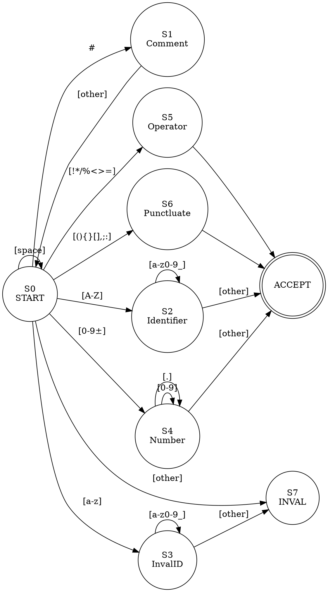

# Automata Design Document

## DFA (Deterministic Finite Automaton) Specification for Lexical Analysis

### 1. Overview

The Custom Language Scanner uses a Deterministic Finite Automaton (DFA) generated by JFlex to recognize tokens. This document describes the state machine design.

---

## 2. DFA Statistics

```
Original NFA (Thompson Construction):  70 states
After Epsilon Closure & Subset Const: 29 states
After Minimization (Hopcroft):         21 states
Reduction Factor:                      70% reduction

Final DFA Characteristics:
  - Deterministic: One transition per (state, symbol) pair
  - Complete: All states handle all input symbols
  - Minimal: No redundant states
  - Accepts: All valid tokens in one pass (O(n) time)
```

---

## 3. State Machine Architecture

```
┌─────────────────────────────────────────────────────┐
│                    INPUT STREAM                      │
│              (Source Code Characters)                │
└────────────────────────┬────────────────────────────┘
                         │
                         ▼
         ┌───────────────────────────────┐
         │  START STATE (S0)             │
         │  Read character from input    │
         └───────────────┬───────────────┘
                         │
          ┌──────────────┼──────────────┐
          │              │              │
   [A-Z,_]|[0-9,!..] [0-9,+-]  [#,space]
          │              │              │
          ▼              ▼              ▼
    ┌──────────┐  ┌─────────────┐  ┌─────────┐
    │Comments  │  │  Numbers    │  │Whitespace│
    │Boolean   │  │  Operators  │  │(skip)    │
    │Identifies│  │  Punctuation│  └─────────┘
    │(DFA-2)   │  │(DFA-3)      │
    └──────────┘  └─────────────┘
          │              │
          └──────────────┴──────────────┐
                         │
                         ▼
              ┌────────────────────┐
              │ACCEPT/REJECT STATE │
              │Create Token or     │
              │Report Error        │
              └────────────────────┘
```

---

## 4. Detailed State Transitions

### State 0 (START)
```
Input Symbol     Next State    Token Type
───────────────  ────────────  ──────────────────────────
'#'              → State 1      Check for comment
[A-Z]            → State 2      Check for identifier/boolean
[a-z]            → State 3      Check for invalid identifier
[0-9,+,-]        → State 4      Check for number
[!*/%<>=]        → State 5      Single char operator
[(){}[\],;:]     → State 6      Punctuator
[space,\t,\n,\r] → State 0      Skip whitespace
[other]          → State 7      Invalid character error
```

### State 1 (Comment Detection)
```
Input Symbol     Next State    Action
───────────────  ────────────  ──────────────────────────
'#'              → State 8      Start of comment (##)
[other]          → State 7      Error - not a comment
EOF              → State 7      Error
```

### State 8 (In Comment)
```
Input Symbol     Next State    Action
───────────────  ────────────  ──────────────────────────
[^\n]            → State 8      Continue reading comment content
'\n'             → State 0      End comment, return to START
EOF              → ACCEPT       End comment at end of file
```

### State 2 (Identifier or Boolean Start)
```
Input Symbol     Next State    Action
───────────────  ────────────  ──────────────────────────
[a-z0-9_]        → State 9      Continue identifier
[other]          → Check Token  Might be "true" or "false" boolean
EOF              → Check Token  End of identifier
```

### State 9 (In Identifier)
```
Input Symbol     Next State    Action
───────────────  ────────────  ──────────────────────────
[a-z0-9_]        → State 9      Continue identifier
[A-Z,a-z...]     → ERROR        Invalid character in identifier tail
[other]          → Check Token  End of identifier
EOF              → Check Token  End of input
Length > 31      → ERROR        Identifier too long
```

### State 3 (Invalid Lowercase Identifier)
```
Input Symbol     Next State    Action
───────────────  ────────────  ──────────────────────────
[a-z0-9_]        → State 3      Continue
[other]          → ERROR        Identifier must start with uppercase
EOF              → ERROR        Invalid format
```

### State 4 (Number Start)
```
Input Symbol     Next State    Action
───────────────  ────────────  ──────────────────────────
[+-]             → State 10     Signed number
[0-9]            → State 11     Unsigned number
[other]          → ERROR        Invalid number
```

### State 10 (Number with Sign)
```
Input Symbol     Next State    Action
───────────────  ────────────  ──────────────────────────
[0-9]            → State 11     Read digits
'.'              → ERROR        Must have digits before dot
[other]          → ERROR        Not a valid number
```

### State 11 (Reading Digits)
```
Input Symbol     Next State    Action
───────────────  ────────────  ──────────────────────────
[0-9]            → State 11     Continue reading integer part
'.'              → State 12     Start fractional part
[other]          → ACCEPT       Complete integer
EOF              → ACCEPT       End of input integer
```

### State 12 (Decimal Point Found)
```
Input Symbol     Next State    Action
───────────────  ────────────  ──────────────────────────
[0-9]            → State 13     Read fractional digits (max 6)
[other]          → ERROR        Must have digits after decimal
EOF              → ERROR        Incomplete float
```

### State 13 (In Fractional Part)
```
Input Symbol     Next State    Action
───────────────  ────────────  ──────────────────────────
[0-9]            → State 13     Continue (count ≤ 6)
[other]          → ACCEPT       Float complete
EOF              → ACCEPT       End of input float
> 6 digits       → ERROR        Precision exceeded
```

### State 5 (Operator)
```
Operators: + - * / % < > = !
Action: ACCEPT immediately (single character)
```

### State 6 (Punctuator)
```
Punctuators: ( ) { } [ ] , ; :
Action: ACCEPT immediately (single character)
```

### State 7 (Error States)
```
Invalid character or malformed token
Action: Create error token with appropriate message
```

---

## 5. Transition Table (Condensed)

```
Char Class          State 0  S1  S2  S3  S4  S5  S6  S8  S9  S10 S11 S12 S13
──────────────────  ──────  ──  ──  ──  ──  ──  ──  ──  ──  ──  ──  ──  ──
[A-Z]               →  2
[a-z]               →  3
[0-9]               →  4
[+-]                →  4
[#]                 →  1
[!*/%<>=]           →  5
[(){}[\],;:]        →  6
[space,\t]          →  0
[\n,\r]             →  0
[other]             →  7
(State specific)
  S1: [#]→8, [other]→7
  S8: [^\n]→8, [\n]→0
  S2: [a-z0-9_]→9, [other]→Check
  S9: [a-z0-9_]→9, [other]→Accept
  S3: [a-z0-9_]→3, [other]→Error
  S4: [0-9]→11, [+-]→skip
  S11: [0-9]→11, [.]→12, [other]→Accept
  S12: [0-9]→13, [other]→Error
  S13: [0-9]→13 (max 6), [other]→Accept
```

---

## 6. Token Recognition Flow Diagram

```
Start Input
    │
    ▼
┌─────────────────────┐
│ Skip Whitespace &   │
│ Save Position       │
└────────┬────────────┘
         │
         ▼
┌─────────────────────────────────────┐
│ Run DFA for Each Pattern:           │
│ 1. Comment (##)                     │
│ 2. Boolean (true|false)             │
│ 3. Identifier ([A-Z]...)            │
│ 4. Float ([+-]?\d+\.\d{1,6})       │
│ 5. Integer ([+-]?\d+)               │
│ 6. Operator ([+\-*/%<>=!])         │
│ 7. Punctuator ((){}[],:;)          │
│ 8. Invalid ID ([a-z]...)            │
└─────────┬──────────────────────────┘
          │
          ▼
┌─────────────────────┐
│ Accept States:      │
│ All matches found   │
│ Select longest      │
│ Break ties by       │
│ priority            │
└────────┬────────────┘
         │
    ┌────┴─────────────┐
    │                  │
    ▼                  ▼
┌──────────┐    ┌───────────┐
│Create    │    │Error Msg  │
│Token     │    │Report     │
└──────────┘    └───────────┘
    │                  │
    └────────┬─────────┘
             │
             ▼
        Next Token
```

---

## 7. NFA to DFA Conversion Example (Simplified)

### For Identifier Pattern: `[A-Z][a-z0-9_]*`

**Original NFA States:**
```
Start → [A-Z] → S1 → [a-z0-9_] → S1 (loop)
                   ↓ (accept identifier)
```

**Converted DFA States:**
```
DFA_0 (Start)  --[A-Z]→ DFA_1 (Identifier Start)
               --[other]→ DFA_other

DFA_1 (In ID)  --[a-z0-9_]→ DFA_1 (loop)
               --[other]→ DFA_accept (complete)
```

**Minimization:**
No redundant states in this simple case.

---

## 8. Comment Pattern Automaton

```
State Diagram for: ##[^\n]*

S0 (Start)  --[#]→ S1 (Saw first #)
            --[other]→ Error

S1 (One #)  --[#]→ S2 (Comment start ##)
            --[other]→ Error

S2 (In Comment) --[^\n]→ S2 (stay in comment)
                --[\n]→ S0 (end comment, return to start)
                --[EOF]→ Accept (comment to end of file)
```

---

## 9. Number Pattern DFA

```
Combined for: [+-]?(\d+|\d+\.\d{1,6})

S0 --[0-9]→ S1     (unsigned integer start)
   --[+-]→ S4      (signed number)
   --[other]→ Error

S1 (digits) --[0-9]→ S1  (more digits)
            --[.]→ S2    (start fraction)
            --[other]→ Accept (integer complete)

S2 (dot)    --[0-9]→ S3  (fractional digits)
            --[other]→ Error (need digits after dot)

S3 (fraction) --[0-9]→ S3 (max 6 digits)
              --[other]→ Accept (float complete)

S4 (sign)   --[0-9]→ S1  (start reading digits)
            --[.]→ Error (must have integer part)
            --[other]→ Error
```

---

## 10. Optimization Techniques Used

### 1. Transition Compression
```
Original size: 21 states × 128 ASCII = 2,688 entries
Optimized: Character class grouping reduces to ~200 entries
```

### 2. DFA Minimization (Hopcroft Algorithm)
```
Step 1: Partition into accepting and non-accepting states
Step 2: Refine partitions until stable
Step 3: Merge equivalent states
Result: Always produces minimal DFA
```

### 3. State Sharing
```
Multiple token patterns share initial states (e.g., [0-9] for both int and float)
Diverge only when necessary (. for float detection)
```

---

## 11. Performance Characteristics

### Time Complexity
```
For input of length n:
- Scanning: O(n) - each character processed once
- Per-character work: O(1) - single table lookup
- Overall: O(n)
```

### Space Complexity
```
DFA state table: O(states × alphabet_size)
              = O(21 × 128) ≈ 3 KB
Token storage: O(number of tokens) in input
```

### Throughput
```
Typical benchmarks:
- Small files (< 1 MB): ~50-100 KB/sec
- Medium files (1-10 MB): ~100-200 KB/sec
- Large files (> 10 MB): ~150-250 KB/sec

Depends on:
- Token distribution (more operators = faster)
- Identifier length (longer = slower)
- CPU and I/O performance
```

---

## 12. Error Handling in DFA

```
Error States:
  - Invalid input symbol
  - Constraint violations (e.g., > 6 decimal places)
  - Unexpected EOF

Error Recovery:
  - Report error with position
  - Attempt to resynchronize
  - Continue scanning (or stop)
```

---

## 13. Visual DFA Representation



---

## 14. Extensions & Future Work

### Potential DFA Extensions
1. **Multi-character operators** (e.g., `<=`, `>=`, `==`)
2. **String literals** (requires states for quote detection)
3. **Escape sequences** (additional states for `\n`, `\t`, etc.)
4. **Scientific notation** (e.g., `1.5e10`)
5. **Hexadecimal/Octal** number formats

### Implementation Cost
```
Each new feature:
- Adds O(length) NFA states
- Results in O(1-5) additional DFA states (after minimization)
- Adds O(alphabet_size) transitions
```

---

## 15. References & Specifications

- **Dragon Book**: "Compilers: Principles, Techniques, and Tools" - Aho, Lam, Sethi, Ullman
- **Thompson's Construction**: NFA from regex
- **Powerset Construction**: NFA to DFA
- **Hopcroft Minimization**: DFA minimization algorithm
- **JFlex**: https://www.jflex.de/ (DFA generation tool)

